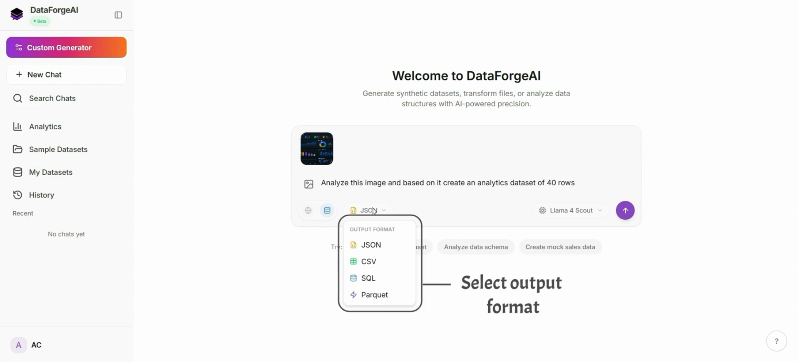

<div align="center">

# 🌟 DataForgeAI Frontend

**React · Vite · Tailwind CSS**

[](https://react.dev/)
[](https://vitejs.dev/)
[](https://www.typescriptlang.org/)
[](https://tailwindcss.com/)
[](https://recharts.org/)

<br />

🎥 [Demo 1](https://youtu.be/BG-SnTXXucQ) · 🎥 [Demo 2](https://youtu.be/JZllTuYlBQk) · 📝 [Kaggle Writeup](https://www.kaggle.com/writeups/ameyac11/dataforgeai) · 🔗 [DOI](https://doi.org/10.34740/kaggle/w/86627)

<br />

### 📸 Preview

<table align="center">
  <tr>
    <td align="center" width="50%">
      <a href="https://youtu.be/JZllTuYlBQk">
        
      </a>
      <br />
      <sub><b>🏠 Landing Page</b> · <a href="https://youtu.be/BG-SnTXXucQ">Watch Demo</a></sub>
    </td>
    <td align="center" width="50%">
      <a href="https://youtu.be/JZllTuYlBQk">
        
      </a>
      <br />
      <sub><b>💬 DataNest Chat</b> · <a href="https://youtu.be/JZllTuYlBQk">Watch Demo</a></sub>
    </td>
  </tr>
</table>

</div>

<br />

The client app for **DataForgeAI** — an AI-powered platform to generate synthetic datasets, analyze CSV data, and export branded PDF reports. This repo contains the React SPA; the [Backend API](https://github.com/ameyac11/DataForgeAI_Backend) handles auth, LLM orchestration, analytics, and storage.

---

## 🔗 Related Repository

| Repo | Description |
|:---|:---|
| ⚙️ [**DataForgeAI Backend**](https://github.com/ameyac11/DataForgeAI_Backend) | FastAPI server — dataset generation, analytics engine, auth & storage |

---

## ✨ Features

- 💬 **DataNest Chat** — Conversational dataset generation with live streaming
- 🧬 **Custom Generator** — Define schemas, preview rows, and download datasets
- 📊 **Analytics Workspace** — Upload CSVs, explore charts, run what-if simulations
- 📄 **PDF Reports** — One-click branded analytics report export
- 📁 **Dataset Library** — Manage, download, and organize generated datasets
- 🔐 **Authentication** — Login · signup · Google & GitHub OAuth
- 🚀 **Onboarding** — Guided setup for new users
- 📱 **Responsive** — Desktop & mobile ready with 50+ ShadCN UI components

---

## 🛠️ Tech Stack

| | |
|:---:|:---|
| ⚛️ | **React 18** · TypeScript · Vite |
| 🎨 | **Tailwind CSS** · ShadCN · Radix UI · Framer Motion |
| 🔄 | **React Query** · React Hook Form · Zod |
| 📈 | **Recharts** — interactive analytics charts |
| 🗺️ | **React Router** |
| 📄 | React Markdown · remark-gfm |

---

## 📋 Prerequisites

- **Node.js** 18+ and npm
- Running [DataForgeAI Backend](https://github.com/ameyac11/DataForgeAI_Backend) instance (local or deployed)

---

## 🚀 Quick Start

```bash
git clone https://github.com/ameyac11/DataForgeAI_Frontend.git
cd DataForgeAI_Frontend

npm install
cp .env.example .env
npm run dev
```

🌐 App → [`http://localhost:8080`](http://localhost:8080)

### Environment Variables

| Variable | Description | Default |
|:---|:---|:---|
| `VITE_API_URL` | Backend API base URL | `http://localhost:8000/api/v1` |
| `VITE_WEB3FORMS_KEY` | Optional — contact form submissions via [Web3Forms](https://web3forms.com/) | — |

---

## 📁 Project Structure

```
src/
├── components/   # UI components (ShadCN, landing, analytics)
├── pages/        # Route pages (Dashboard, DataNest, Analytics, Auth, …)
├── services/     # API clients & data fetching
├── hooks/        # Custom React hooks
└── lib/          # Utilities & shared helpers
```

---

## 📜 Scripts

| Command | Description |
|:---|:---|
| `npm run dev` | Start dev server on port 8080 |
| `npm run build` | Production build |
| `npm run preview` | Preview production build locally |
| `npm run lint` | Run ESLint |

---

## 🌟 Support

If you find this project useful or interesting, please consider giving it a ⭐ on GitHub! Your support helps make the project more visible and encourages further development.

---

## 📜 License

[](./LICENSE)

Licensed under the **GNU Affero General Public License v3.0 (AGPL-3.0)**.  
Copyright © 2026 Ameya Sanjay Chopade · See [LICENSE](./LICENSE) for details.

